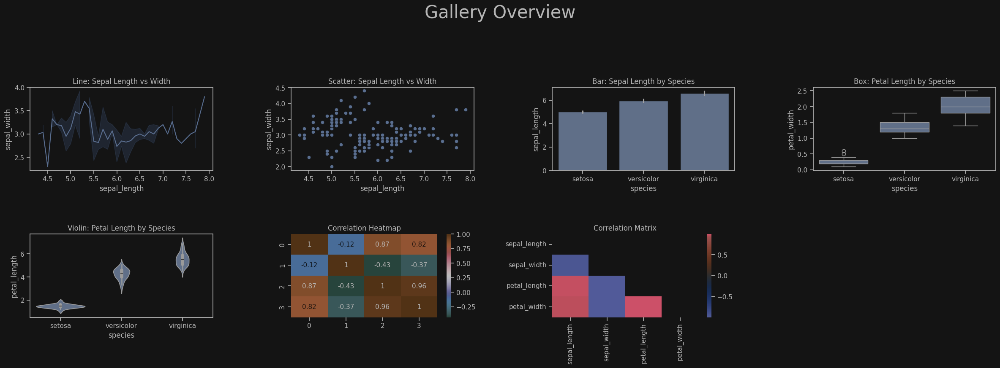

# Python Data Vis

#### Python visualisations displayed in Jupyter Notebooks
**For Python ≥ 3.10, interactive demos live in notebooks/<br>**
**Start with 01_line.ipynb or head over to 08_sea_helpers.ipynb<br>**
**for full gallery of plots including seaborn pair plot representation.<br>** 

---

<p>

</p>

---

#### Project Structure

```
Python-Data-Vis/
├── pyproject.toml
├── src/
│   ├── part1/
│   │   ├── __init__.py
│   │   └── line_plot.py ...
│   └── part2/
│       ├── __init__.py
│       └── sea_helpers.py
├── notebooks/
│   ├── 01_line.ipynb ...
│   └── 08_sea_helpers.ipynb
├── docs/
│   └── img/
│       └── gallery_overview.png
├── .gitignore       # .venv/, __pycache__/
└── README.md        # you are here
```

---

#### Quick Start 

**Clone this repo:**  
```git clone git@github.com:neilburbage/Python-Data-Vis```  
**Add an SSH key:**   
https://docs.github.com/en/authentication/connecting-to-github-with-ssh   
```cd Python-Data-Vis```  
**Create a virtual environment:**       
```python -m venv .venv```  
```# Linux / macOS: source .venv/bin/activate```     
```# Windows (PowerShell): .venv\Scripts\Activate.ps1```  
```# Windows (cmd): .venv\Scripts\activate.bat```  
**Install dependencies, enable editable mode to apply changes without reinstall:**      
```pip install -e .```  
```from part2 import sns_line, sns_scatter```

---

#### Parts

**Part1 is an introduction to matplotlib on a one file per plot basis.**<br>
**Part2 takes the best of Part1 to the next level with seaborn plots.**

##### Part1

**One helper file per plot (line_plot.py, bar_plot.py, …).<br>**
**Matching notebook per helper for demos.**

##### Part2

**All Seaborn helpers centralised in sea_helpers.py.<br>**
**08_sea_helpers.ipynb shows a gallery of every helper in one place.**

---